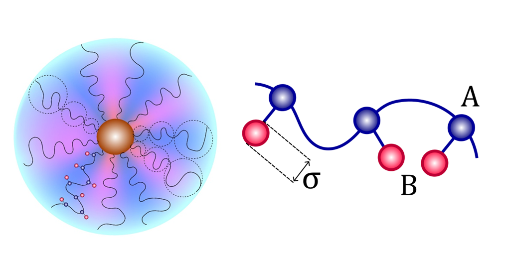
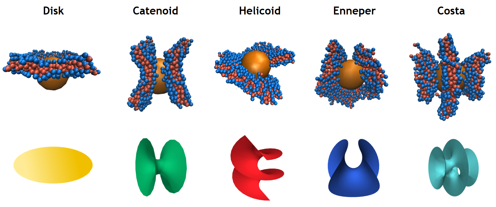
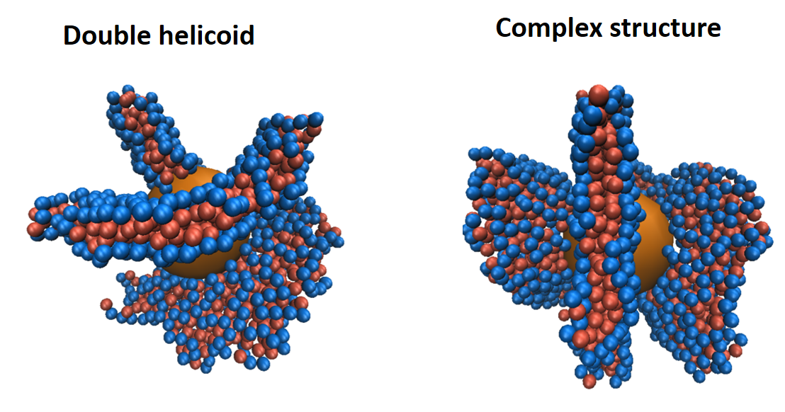
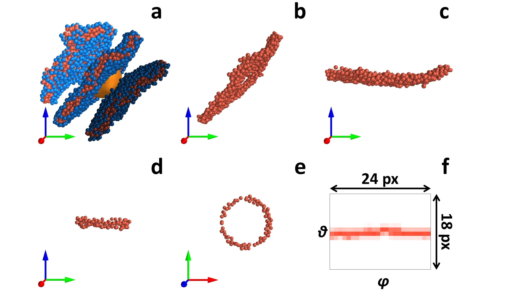
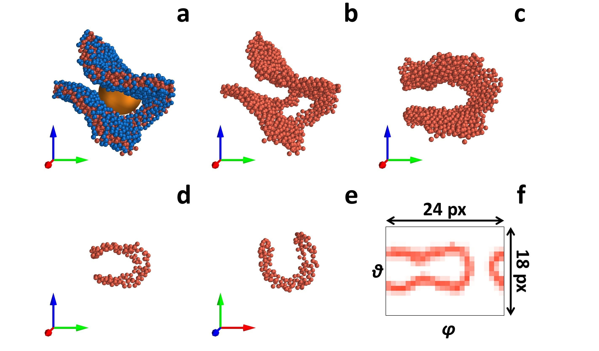
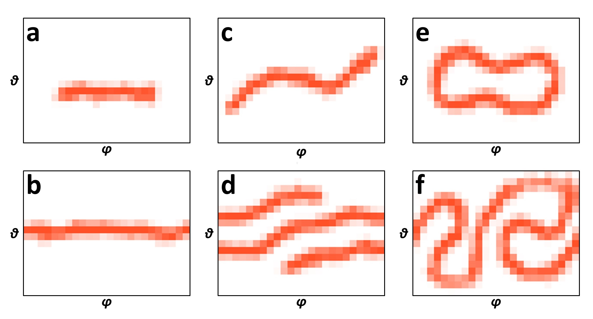
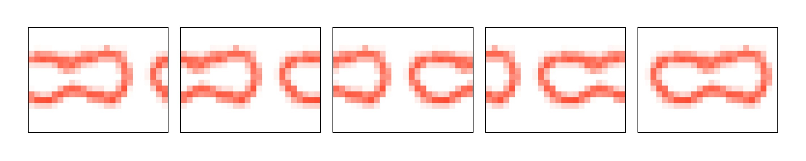
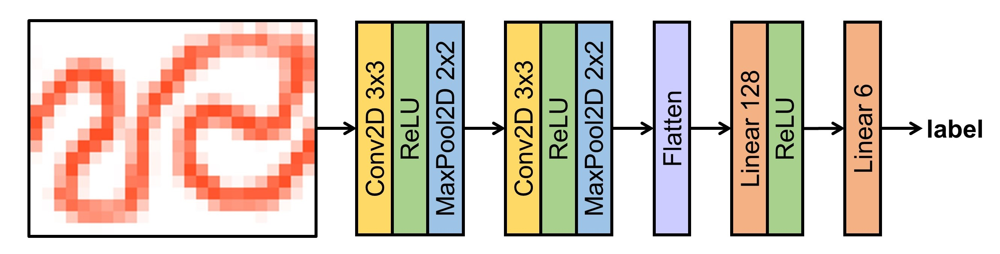

# Deep Learning Based Classification of Amphiphilic Homopolymers Structures
## Introduction

In accordance with the aim of the paper, we examined a spherical nanoparticle of radius R, decorated by M macromolecules with N amphiphilic monomer units. The amphiphilic monomer units embody both solvophilic and solvophobic groups and are represented as A-graft-B "dumbbells," consisting of two beads with a diameter σ. The beads A are linked together, forming the chain backbone, while beads B serve as freely rotating side pendants (Fig. 1). The macromolecules are softly grafted onto the nanoparticle surface in the sense that the attachment points - A beads of the first monomer units of grafted macromolecules - are located in a thin ~ σ near-surface layer and are capable of moving freely along the nanoparticle surface. The decorated nanoparticle is immersed in a selective solvent, which is athermal for the main chain A groups and poor for the pendant B groups.

**Figure 1** - Model of an amphiphilic homopolymer with A-graft-B monomer units (a) and a nanoparticle decorated with macromolecules of the amphiphilic homopolymer (b). 

In poor for side-pendant solvent, the macromolecules self-assemble into thin membrane-like ABBA bilayers deviated from spherical nanoparticle. The bilayers form morphological structures, that depend on the grafting density and macromolecular polymerization degree, and can be referred to the classical family of complete embedded minimal surfaces: plane disk, catenoid, helicoid, Costa and Enneper surfaces (Fig. 2)/ Also “double” helicoid and “complex surfaces” (Fig 3) were identified.

**Figure 2** - Typical bilayer structures of amphiphilic homopolymers grafted to a spherical nanoparticle and their corresponding minimal surfaces.

**Figure 3** - Instant snapshots of double helicoid and complex structure.

In this repository, we put forth an algorithm for the classification of amphiphilic homopolymers grafted to a spherical nanoparticle, employing an ensemble of CNN models based on flat projections of the original structures.

## Data

The data comprise point clouds of different types of points placed in three-dimensional space. Since some structures can be subdivided into simpler components, the structures were first clustered using the DBSCAN method from the sklearn.cluster module with parameter values eps = 1.6 and min_samples = 13, which yielded the most optimal results. The individual elements were aligned by bringing the inertia tensor to the principal axes. Given that the layers are oriented perpendicularly, a spherical layer of attachment points located near the nanoparticle was considered (Fig. 4, 5).

**Figure 4** - Sequence of data preparation for machine learning algorithm using Costa structure as an example: DBSCAN clustering of the structure into separate elements (a), selecting the central layer of an element (b), element alignment by bringing its inertia tensor to the principal axes (c), grafting points side view (d) and top view (e), grafting points representation as planar 24x18 pixel image in spherical coordinates θ and φ.

**Figure 5** - Sequence of data preparation for machine learning algorithm using Enneper structure as an example: DBSCAN clustering of the structure into separate elements (a), selecting the central layer of an element (b), element alignment by bringing its inertia tensor to the principal axes (c), grafting points side view (d) and top view (e), grafting points representation as planar 24x18 pixel image in spherical coordinates θ and φ.

The grafted points were represented as two-dimensional graphs in spherical coordinates (φ, θ) with a size of 24x18 pixels (Fig. 6). The grafted points exhibited a consistent thickness and exhibited varying shapes. The pixel intensity is determined by the number of beads in the thin spherical layer surrounding the nanoparticle.

**Figure 6** - Pixel images of spherical projections for typical elements in *φ-θ* coordinates: segment (a); circle (b), zigzag (c), spiral (d), tennis ball (e), serpent (f).

In order to train the neural network, 600 snapshots were required for each class of each element from different morphological structures. The characteristic elements belonging to different morphological structures were considered as independent entities. Furthermore, augmentation was applied to images in spherical coordinates. This involved moving 1/10 of the image from the left side to the right 10 times in a sequential manner. This process served to increase the size of the dataset and to avoid the occurrence of important patterns on the borders (Fig. 7). The resulting images were divided into training, validation and test samples in the ratio 0.8/0.1/0.1 accordingly. In order to prevent the leakage of data, each morphological structure and all of its constituent elements are associated with only one of the data samples, namely training, validation or test.

**Figure 7** - Horizontal sequential transferring part of the image from the left side to the right side 5 times.

## Method

The final structures were determined by applying the convolutional neural network classification of images to all components. The convolutional network's architectural layout is depicted in Figure 8. The network comprises two consecutive convolutional layers, each of which employs 3x3 filters with a step of 1 and a fill of 1. Following each convolutional layer, the rectified linear unit (ReLU) activation function is applied to introduce non-linearity into the model. Subsequently, the max-pooling operation is performed utilising a 2x2 core and step 2, which reduces the dimensionality of the data in order to emphasise more significant image characteristics. Subsequently, the data is transformed into a one-dimensional vector and transmitted to two consecutive fully connected layers. Subsequently, the ReLU activation function is applied to the output of the first fully connected layer. The initial layer comprises 128 neurons, with the number of neurons in the subsequent layer equating to the number of classes.

**Figure 8** - Architecture of the applied convolutional neural network.

The Cross Entropy Loss function was employed as the loss function, which is the standard choice for classification tasks. This function enables the model to efficiently estimate the discrepancy between the predicted class probabilities and the actual labels, thereby facilitating optimal learning.

To evaluate the accuracy of the model, the MulticlassAccuracy metric was employed with parameter average = macro, whereby the statistics were initially calculated for each label and subsequently averaged. This metric is a straightforward and readily comprehensible indicator that permits the assessment of the model's efficacy in performing its designated task.

## Description

### data

**structures** - Folder with np.ndarrays of 3D point clouds of typical amphiphilic homopolymers bilayer structures

**rough_elements.zip** - Archive with np.ndarrays of 3D point clouds of typical elements for CNN training, validation and test

### notebooks

**train_phi_theta_model.ipynb** - Jupiter Notebook with an example of training *φ-θ* model

**predict_structures.ipynb** - Jupiter Notebook with an example of classifying all typical structures using the CNNs pre-trained model

### scripts

**my_geom_functions.py** - Python module that provides several useful functions for geometric transformations and manipulations with points in three-dimensional space. A detailed description of the functions can be found inside the script.

**my_models_functions.py** - Python module for a convolutional neural network (CNN) designed to classify images into one of six classes.It includes functions to initialize the model and to classify both individual elements and composite structures using pixel projections. A detailed description of the functions can be found inside the script.

**my_train_functions.py** - Python module for model training, validation and testing. A detailed description of the functions can be found inside the script.

**prepare_data_functions.py** - Python module for data pre-processing and point cloud imaging in 3D and 2D. A detailed description of the functions can be found inside the script.

### weights
Folder with weight of pre-trained CNN phi-theta model

